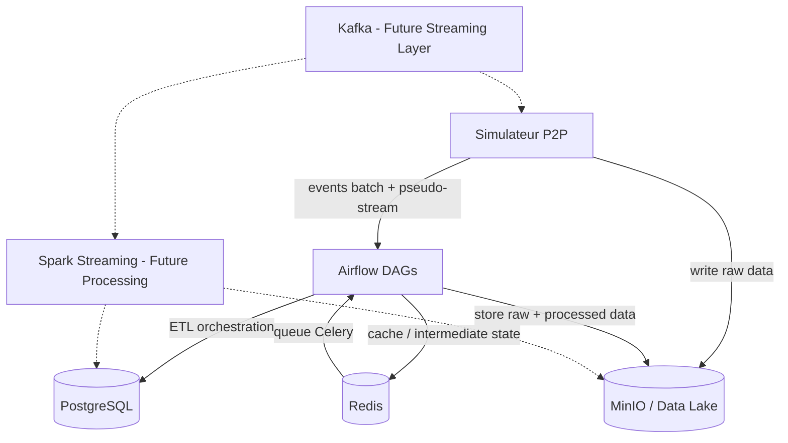

# Architecture SPOTIFY

> **À compléter par votre groupe** — Ce document doit décrire VOTRE architecture, pas celle de référence.

---

## Vision d'ensemble

```
[Insérer ici votre diagramme d'architecture]
Outil recommandé : draw.io, Excalidraw, ou Mermaid (ci-dessous)
```




---

## Décisions architecturales

### ETL vs ELT — Mapping par pipeline

| Pipeline | Approche | Justification |
|----------|----------|---------------|
| catalog_ingestion | ETL | Transformation des données avant stockage pour garantir qualité et cohérence du catalogue musical |
| streaming_events | ELT (future) | Ingestion brute dans Kafka puis traitement différé pour analyse temps réel |
| aggregation | ETL | Calcul de KPIs (écoutes, utilisateurs actifs) dans Airflow avant stockage PostgreSQL |
| streaming_trends (Spark) | ELT | Traitement distribué des événements en quasi temps réel pour détecter tendances |

### Partitionnement Parquet

Expliquer ici votre stratégie de partitionnement des fichiers Parquet sur MinIO.

```
spotify-parquet/
└── listening_events/
    └── date=2025-01-15/
        └── hour=14/
            └── part-00000.parquet
```

**Pourquoi cette structure ?**
→ Le partitionnement est réalisé par :

* date ;
* heure.

Cette stratégie permet :

* d'éviter le scan complet des données ;
* d'améliorer les performances des requêtes analytiques ;
* de faciliter les traitements incrémentaux ;
* de réduire les coûts de lecture des fichiers Parquet.

Exemple :

Une analyse portant uniquement sur les écoutes du 15 janvier à 14h ne lira que la partition correspondante.
 

### Topics Kafka — Stratégie de partitionnement

| Topic | Partitions | Clé | Justification |
|-------|-----------|-----|---------------|
| listening_events | 6 | user_id | Garantit l’ordre des événements d’un même utilisateur. |
| p2p_network_events | 6 | peer_id | Tous les événements d’un même pair arrivent sur la même partition. |
| catalog_updates | 3 | track_id | Garantit la cohérence des mises à jour du catalogue. |
| fraud_alerts | 3 | user_id | Facilite le suivi des comportements suspects d’un utilisateur. |

**Pourquoi `user_id` comme clé pour `listening_events` ?**
→ Kafka garantit l'ordre uniquement à l'intérieur d'une partition.

En utilisant `user_id` comme clé :

* toutes les écoutes d'un utilisateur sont envoyées dans la même partition ;
* l'ordre chronologique des événements est conservé ;
* Spark peut reconstruire correctement le comportement utilisateur ;
* les calculs d'agrégation deviennent plus simples.

---

## Choix techniques

### Pourquoi CeleryExecutor (pas KubernetesExecutor) ?

→ Le projet est exécuté dans un environnement Docker Compose local.

CeleryExecutor présente plusieurs avantages :

* plus simple à configurer ;
* compatible avec Redis déjà utilisé comme broker ;
* adapté aux besoins du projet ;
* consommation de ressources plus faible ;
* déploiement rapide pour un projet académique.

KubernetesExecutor aurait nécessité :

* un cluster Kubernetes ;
* davantage de configuration ;
* une infrastructure plus complexe à maintenir.

Pour un projet pédagogique, CeleryExecutor offre le meilleur compromis entre simplicité et scalabilité.


### Gestion des secrets

→ Les credentials sont centralisés dans les variables d'environnement Docker Compose.
Exemples :

```yaml
POSTGRES_USER=airflow
POSTGRES_PASSWORD=airflow

MINIO_ROOT_USER=minioadmin
MINIO_ROOT_PASSWORD=minioadmin
```

Dans un environnement de production, ces secrets devraient être stockés dans :

* Docker Secrets ;
* HashiCorp Vault ;
* AWS Secrets Manager ;
* Azure Key Vault.

Cette approche permet :

* d'éviter les mots de passe en dur dans le code ;
* de simplifier la rotation des secrets ;
* d'améliorer la sécurité globale.

---

## Architecture Lambda — Batch + Speed Layer

```
Speed layer  : Simulateur → Kafka → Spark → PostgreSQL (realtime_*) + Redis
Batch layer  : Simulateur → Kafka (availableNow) → Airflow → PostgreSQL (daily_*) + MinIO
Serving layer: PostgreSQL + Redis ← consommé par les clients
```

**Ce qui est en batch et pourquoi :**
→ Traitements batch :

* agrégations journalières ;
* statistiques historiques ;
* génération des datasets analytiques ;
* export Parquet.

Le batch est utilisé lorsque :

* une faible latence n'est pas nécessaire ;
* les calculs sont coûteux ;
* les données sont analysées sur de longues périodes.


**Ce qui est en streaming et pourquoi :**
→ Traitements streaming :

* tendances musicales en temps réel ;
* détection de fraude ;
* monitoring du réseau P2P ;
* métriques de consommation instantanées.

Le streaming est utilisé lorsque :

* les résultats doivent être disponibles immédiatement ;
* la réactivité métier est importante ;
* les événements arrivent en continu.

---

## Schémas d'événements

### listening_event

```json
{
  "event_id":    "uuid",
  "user_id":     "uuid",
  "track_id":    "uuid",
  "source_peer": "uuid",
  "timestamp":   "2025-01-15T14:30:00Z",
  "duration_ms": 45000,
  "device_type": "mobile",
  "geo_country": "FR",
  "completed":   true,
  "event_source": "p2p"
}
```

### p2p_network_event

```json
{
  "event_id":   "uuid",
  "event_type": "chunk_transfer",
  "peer_id":    "uuid",
  "target_peer": "uuid",
  "track_id":   "uuid",
  "chunk_size_bytes": 65536,
  "latency_ms": 12,
  "timestamp":  "2025-01-15T14:30:01Z"
}
```

---

## Leçons apprises

> À compléter au fur et à mesure de la semaine.

- **Lundi** : ...
- **Mardi** : ...
- **Mercredi** : ...
- **Jeudi** : ...
- **Vendredi** : ...
