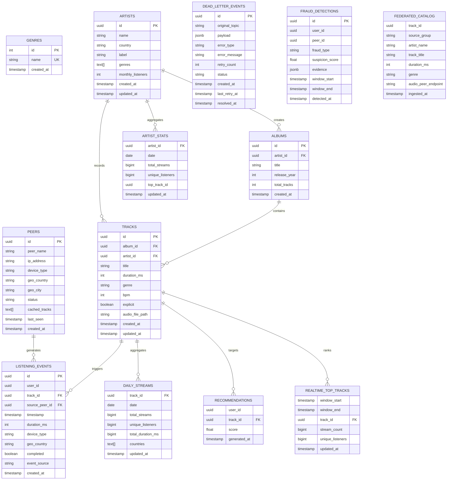

# Modèle de données — Spotify Décentralisé

## Diagramme Entité-Relation



## Vue d'ensemble des tables

| Table | Rôle | Records/jour |
|-------|------|-------------|
| `genres` | Référentiel (10 lignes) | — |
| `artists` | Catalogue de musiciens | ~1K |
| `albums` | Albums d'artistes | ~5K |
| `tracks` | Catalogue musical complet | ~50K |
| `peers` | Nœuds du réseau P2P | ~1K actifs |
| **`listening_events`** | Cœur de la pipeline (raw) | **~1M événements** |
| `daily_streams` | Agrégat batch par track | ~50K |
| `artist_stats` | Agrégat batch par artist | ~1K |
| `recommendations` | Scores ML user-track | ~100M |
| `dead_letter_events` | DLQ (erreurs) | ~10K |
| `realtime_top_tracks` | Top tracks temps réel | ~2K lignes |
| `fraud_detections` | Anomalies détectées | ~100/jour |
| `federated_catalog` | Partage inter-groupes | ~50K |

---

## Question 1 : Index sur `timestamp` ET `date_trunc('hour', timestamp)` ?

### Réponse

Ces deux index optimisent deux **patterns de requête différents** :

| Index | Pattern | Cas d'usage |
|-------|---------|-----------|
| `idx_listening_events_timestamp` | Plage fine : `WHERE timestamp BETWEEN t1 AND t2` | Retraçage d'un incident, audit d'utilisateur (requête ponctuelle) |
| `idx_listening_events_ts_partition` | Agrégation horaire : `GROUP BY date_trunc('hour', timestamp)` | Dashboards temps réel, fenêtres glissantes Spark (requête répétitive) |

**Exemple concret :**

```sql
-- ✅ Utilise idx_listening_events_timestamp
SELECT COUNT(*) FROM listening_events
WHERE timestamp BETWEEN '2025-06-01 14:30:00' AND '2025-06-01 14:35:00';

-- ✅ Utilise idx_listening_events_ts_partition
SELECT 
    date_trunc('hour', timestamp) AS hour,
    COUNT(*) AS streams
FROM listening_events
GROUP BY 1
ORDER BY hour DESC LIMIT 24;
```

**Impact performance :** Sans l'index sur expression, PostgreSQL recalcule `date_trunc()` pour chaque ligne (~1M fois). Avec l'index, l'agrégation est directe.

---

## Question 2 : Différence `daily_streams` vs `realtime_top_tracks` ?

### Réponse

| Critère | `daily_streams` | `realtime_top_tracks` |
|---------|-----------------|----------------------|
| **Source** | Batch PostgreSQL sur `listening_events` | Spark Structured Streaming en continu |
| **Fréquence** | 1 jour = DATE complète | Fenêtres 5 min glissantes |
| **Latence de la donnée** | 0-24h (dernière maj demain 02:00) | <30 secondes |
| **Cardinalité** | ~50K tracks × 365j = 18M lignes | ~2K tracks × 288 windows/j = 576K lignes |
| **Utilisation** | Rapports analytiques, facturation | Dashboards live ("Trending Now") |

**Quand utiliser quelle table :**

```
daily_streams → "Top 100 tracks d'hier"
realtime_top_tracks → "Top 100 tracks DES 5 DERNIÈRES MINUTES"
```

---

## Question 3 : Pourquoi `payload` en `JSONB` et pas `TEXT` ?

### Réponse

**`JSONB` apporte trois avantages critiques :**

1. **Requêtes sur le contenu :** Extraction directe par clé  
   ```sql
   -- ✅ JSONB : opérateur ->
   SELECT * FROM dead_letter_events 
   WHERE payload->>'error_type' = 'network_timeout';
   
   -- ❌ TEXT : regex (SLOW)
   SELECT * FROM dead_letter_events 
   WHERE payload LIKE '%"error_type":"network_timeout"%';
   ```

2. **Indexation :** GIN index sur JSONB permet des recherches O(log n)  
   ```sql
   CREATE INDEX idx_payload ON dead_letter_events 
       USING GIN (payload);
   ```

3. **Retraitement automatique :** Conversion directe en tuples SQL  
   ```sql
   INSERT INTO listening_events (user_id, track_id, timestamp)
   SELECT 
       (payload->>'user_id')::uuid,
       (payload->>'track_id')::uuid,
       to_timestamp(payload->>'timestamp', 'YYYY-MM-DD HH24:MI:SS')
   FROM dead_letter_events
   WHERE status = 'pending';
   ```

---

## Indices créés

```sql
-- listening_events : 4 index pour analytique
CREATE INDEX idx_listening_events_user_id ON listening_events(user_id);
CREATE INDEX idx_listening_events_track_id ON listening_events(track_id);
CREATE INDEX idx_listening_events_timestamp ON listening_events(timestamp);
CREATE INDEX idx_listening_events_ts_partition ON listening_events(date_trunc('hour', timestamp));

-- dead_letter_events : 2 index pour monitoring
CREATE INDEX idx_dlq_status ON dead_letter_events(status);
CREATE INDEX idx_dlq_created_at ON dead_letter_events(created_at);
```

**Total : 11 tables, 6 index + GIN sur JSONB.**